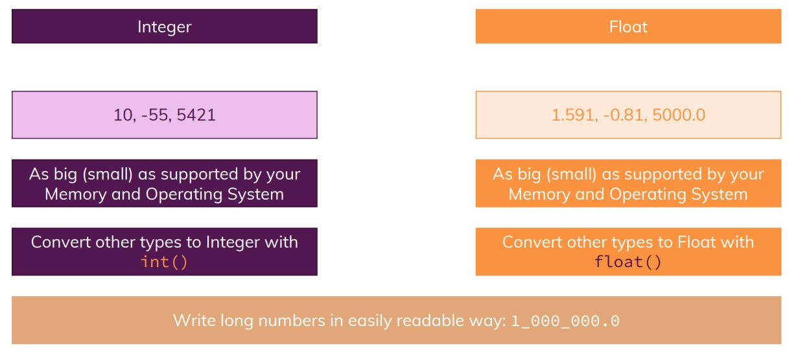
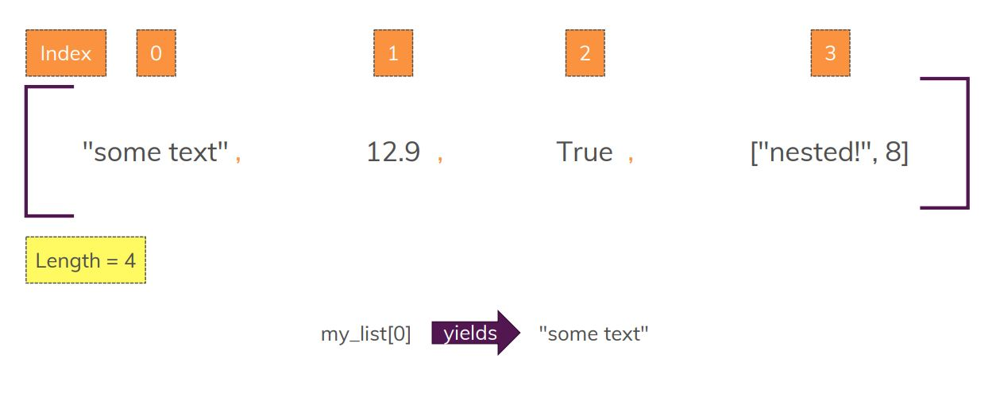
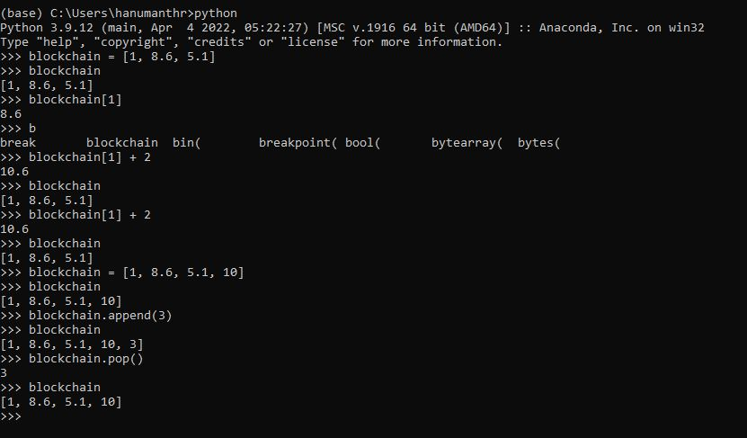
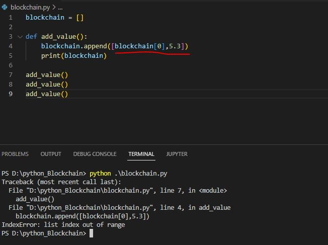
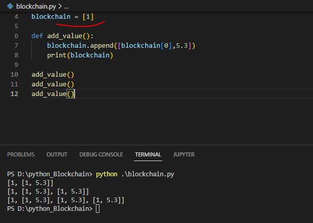
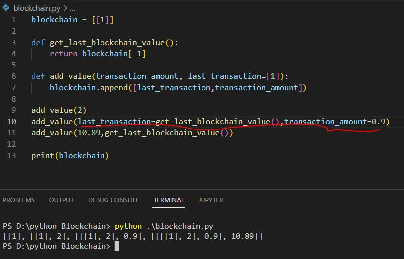
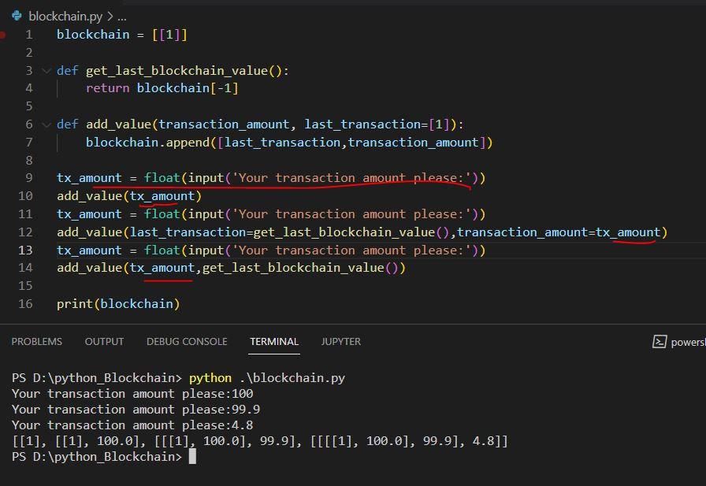
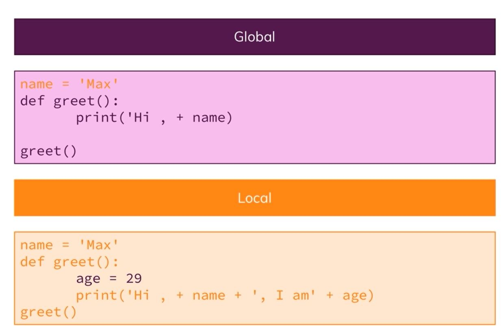

# Base Syntax of Python and Basic Blockchain

# Module Overview

# What about Blockchain?

# Understanding repl and Python Datatypes

## The REPL (Read, Evaluate, Print and Loop)

## Blockchain Picture

## Python Data types

## Working with Variables

## Working with Numbers

## Operators

## Understanding Special Number Behaviour

To understand the missing floating point precision

## Working with text

## Lists

### Adding and Removing List items

## Preparing the Blockchain-Theory

## Installing your IDE

Download any of the IDE you prefer from

https://code.visualstudio.com/download

https://www.jetbrains.com/pycharm/download/#section=windows

https://www.anaconda.com/products/distribution

For visual studio, install the python extension as shown and resart the IDE.

Then create a file, to execute the python program, access view-->Terminal and use the command as shown

## Functions

### Adding List items with functions

We start building our blockchain

### Accessing the last list last list item

### adding arguments

### Understanding the return Keyword

### Default arguments

### Keyword arguments

### Using the input function

### Avoiding repetitive code execution

## Scope of a Variable

## Explore the official docs

Access the link to learn more about python: 
https://docs.python.org/3/

https://peps.python.org/

Style guide for Python code: https://peps.python.org/pep-0008/

