# Base Syntax of Python and Basic Blockchain

# Module Overview

# What about Blockchain?

# Understanding repl and Python Datatypes

## The REPL (Read, Evaluate, Print and Loop)

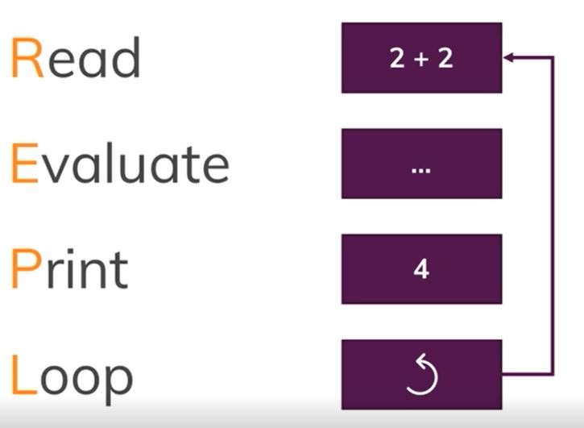

## Blockchain Picture

## Python Data types

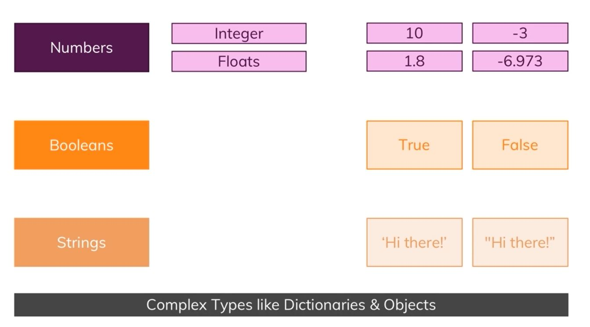

## Working with Variables

## Working with Numbers

## Operators

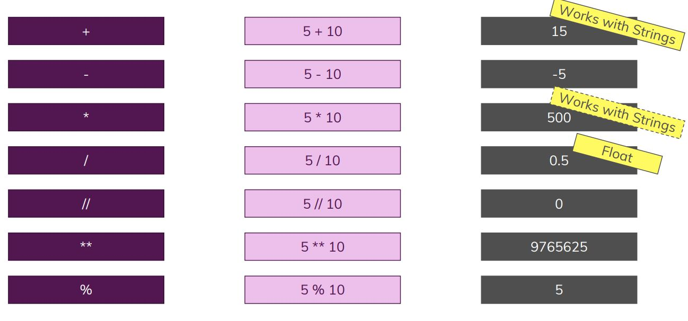

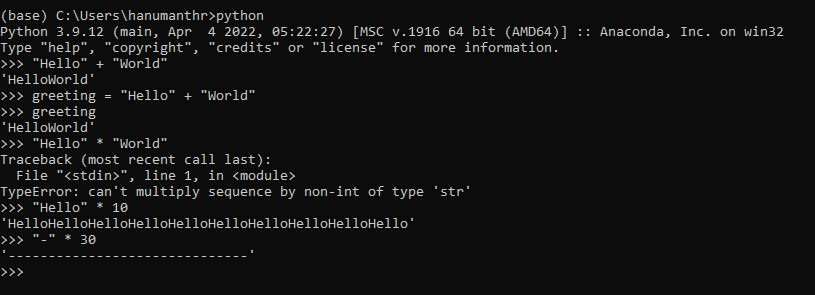

## Understanding Special Number Behaviour

To understand the missing floating point precision

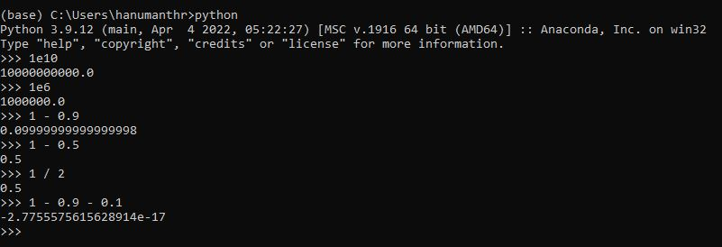

## Working with text

## Lists

### Adding and Removing List items

## Preparing the Blockchain-Theory

## Installing your IDE

Download any of the IDE you prefer from

https://code.visualstudio.com/download

https://www.jetbrains.com/pycharm/download/#section=windows

https://www.anaconda.com/products/distribution

For visual studio, install the python extension as shown and resart the IDE.

Then create a file, to execute the python program, access view-->Terminal and use the command as shown

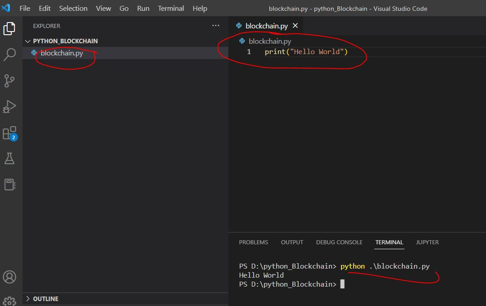

## Functions

### Adding List items with functions

We start building our blockchain

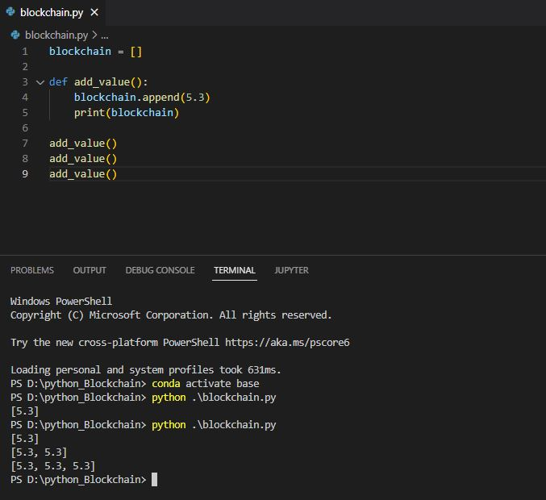

### Accessing the last list last list item

### adding arguments

### Understanding the return Keyword

### Default arguments

### Keyword arguments

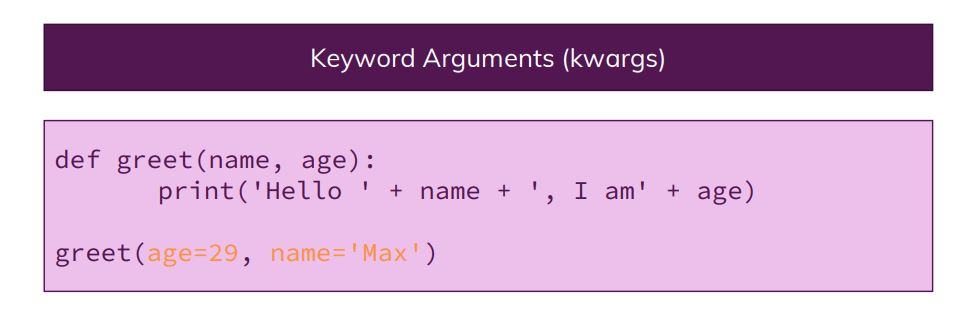

### Using the input function

### Avoiding repetitive code execution

## Scope of a Variable

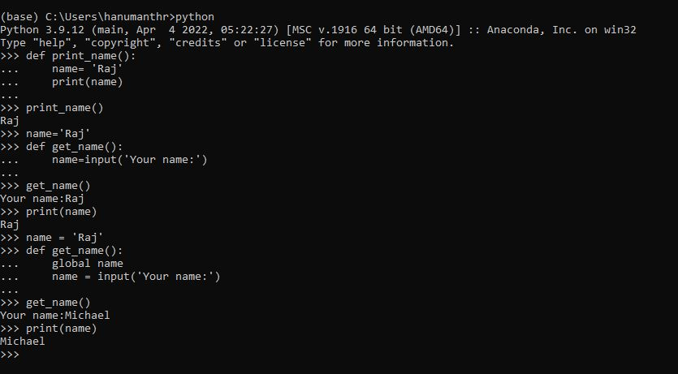

## Explore the official docs

Access the link to learn more about python: 

https://docs.python.org/3/

https://peps.python.org/

Style guide for Python code: https://peps.python.org/pep-0008/

## Comments and doc Strings

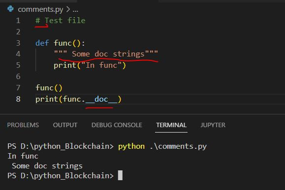

## Blockchain Theory: Understanding Blocks

### What's a Block? 

Of course a "Blockchain" consists of multiple "Blocks" - and a single Block simply can be considered a data storage/ container. You can store ANY data of your choice in a Block.

Cryptocurrencies like Bitcoin are the most prominent use-case of the Blockchain technology but you can also store simple text in Blocks if you want to. Of course using a Blockchain makes most sense for data that should be secure and distributed across a broad network though. Data transparency and safety are key advantages of the Blockchain.

Even when considering Cryptocurrencies, you don't actually store the coins in a Block but rather the transactions between users. A transaction then includes an amount of coins that should be transferred.

In this Tutorial, the Blocks we start with only holds a number. So you can think of it as a transaction, though the sender and recipient is missing. But that's something which will be added once we had a look at more complex data structures than simple lists.

Multiple Blocks in a list of Blocks then form the first simple Blockchain. No worries, it'll get more complex than that over the course of the remaining modules!

## Refer to blockchain.py file , which we implemented in this tutorial

## Module Summary

## Blockchain status

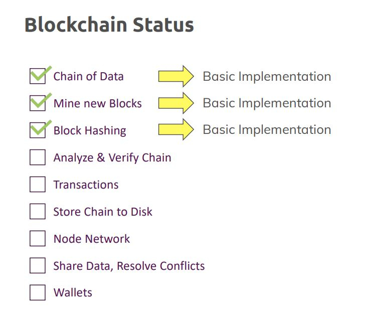

