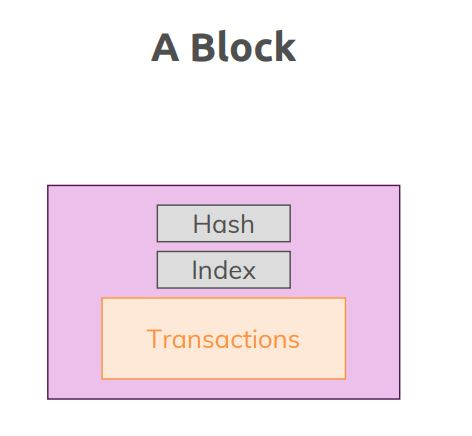
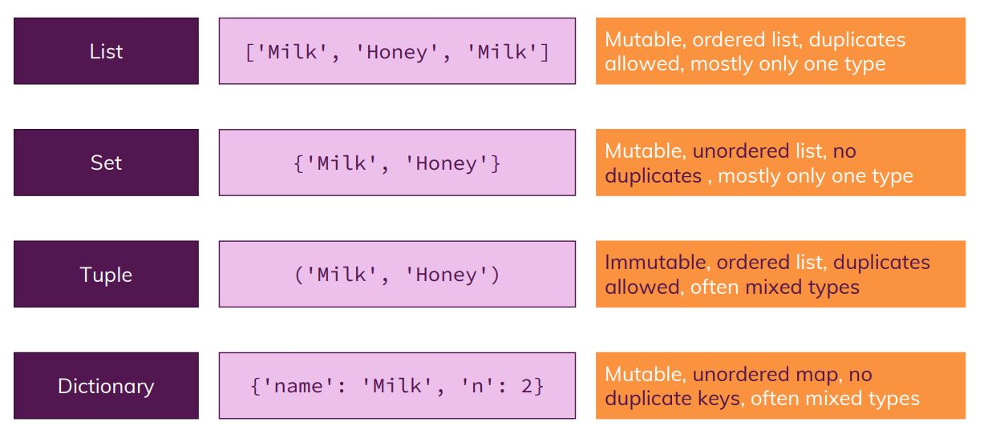
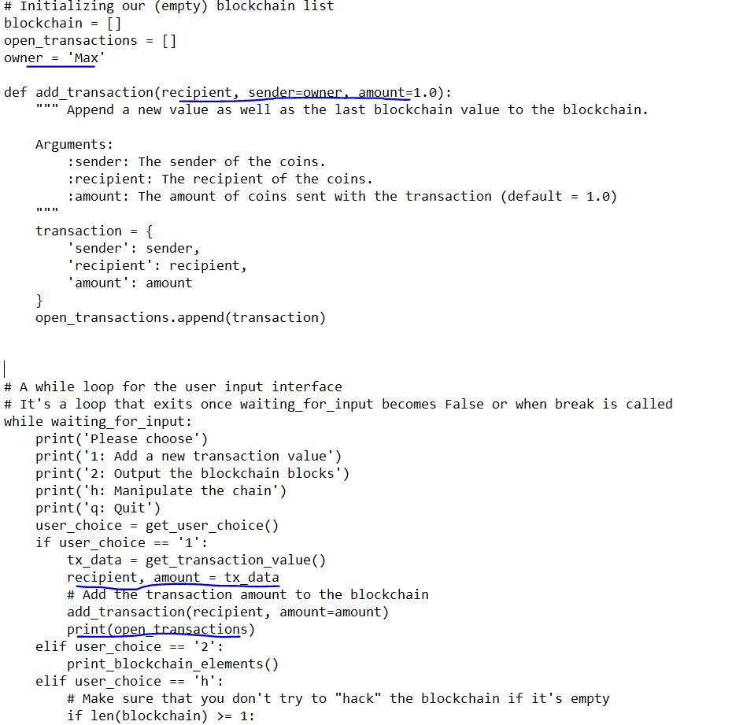
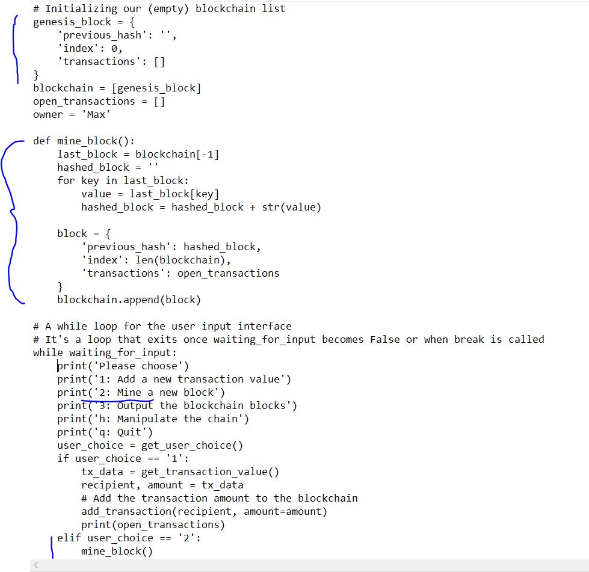

# Understanding Complex Data Structures

# Module Overview

# What about Blockchain?

# Complex Data Structure Requirements

## A Transaction

## A Block

## Managing List of Paricipants

## Iterables Overview

## Choosing the right data structure: Refer to the Transaction, A Block and Manging List of Participants above
 For Transaction: We need Key value pair, we require Dictionary
 
 For List of transactions: We need List
 
 For Blockchain itself: We need List
 
 For Block: Dictionary
 
 For List of participants: Set, for storing unique values

## Transactions with Dictionaries and tuples

Tuple Unpacking

Refer to the **blockchain.py** code in the folder **DATA-S~1**

## Mining blocks and hashing previous block

Refer to the **blockchain.py** code in the folder **data-structures-02-block-mining-baic-hash** 

## List Comprehensions

Refer to the **blockchain.py** code in the folder

 
 

