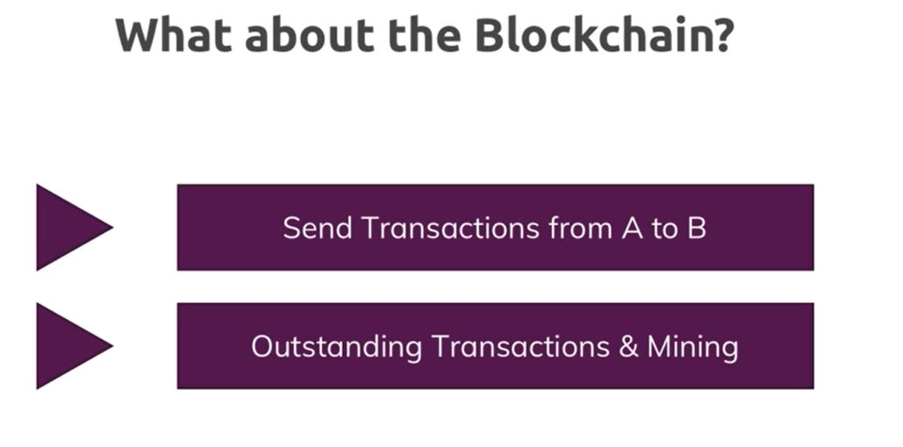
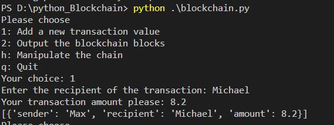
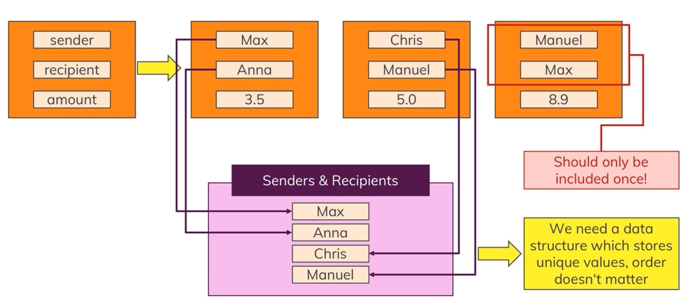
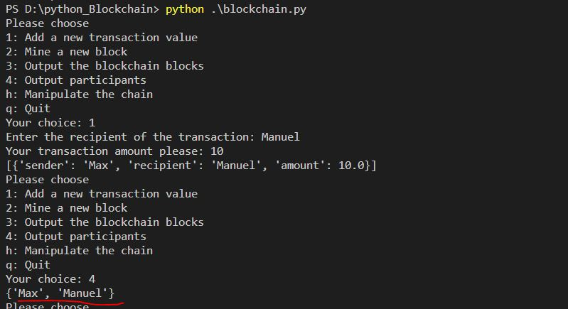
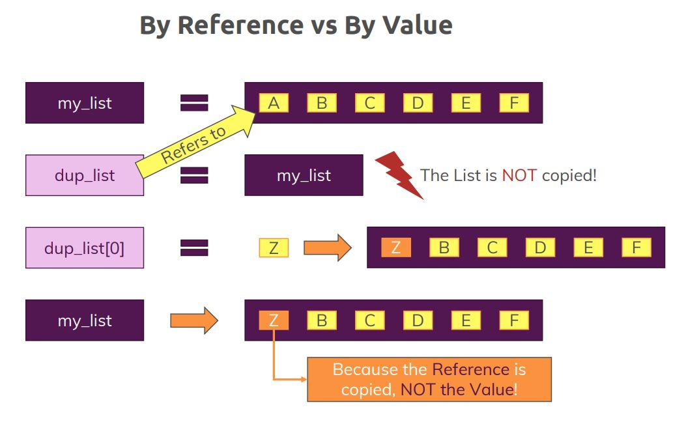
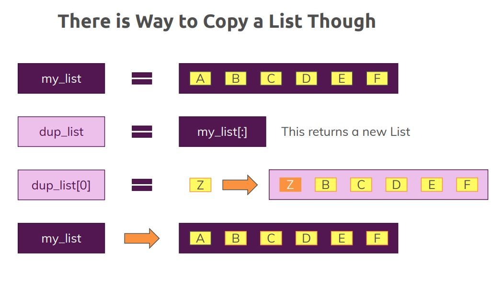
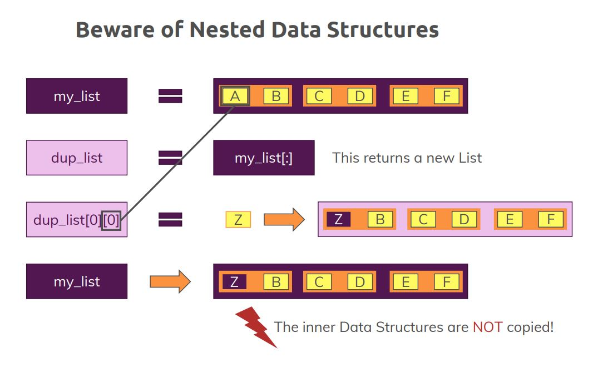

# Understanding Complex Data Structures

# Module Overview

# What about Blockchain?

# Complex Data Structure Requirements

## A Transaction

## A Block

## Managing List of Paricipants

## Iterables Overview

## Choosing the right data structure: Refer to the Transaction, A Block and Manging List of Participants above
 
 For Transaction: We need Key value pair, we require Dictionary
 
 For List of transactions: We need List
 
 For Blockchain itself: We need List
 
 For Block: Dictionary
 
 For List of participants: Set, for storing unique values

## Transactions with Dictionaries and tuples

Tuple Unpacking

Refer to the **blockchain1.py** code 

## Mining blocks and hashing previous block

Refer to the **blockchain2.py** code

## List Comprehensions

Refer to the **blockchain3.py** code

## Dictionary Comprehensions

## List Comprehensions and if

## Improved blockchain Validation logic 

Define new function hash_block(), mine_block() call hash_block(last_block), update the code in verify_chain()

## Manging List of Participants

Refer to the **blockchain4.py** code 

## Calculating Balances

Updates a get_Balance()

## Rewarding Miners

Whenever a Miners create a new block, he needs to be rewarded i.e coins

## Verifying Transactions

Defines verify_transaction()

## Reference Vs Value Copying

 
 

