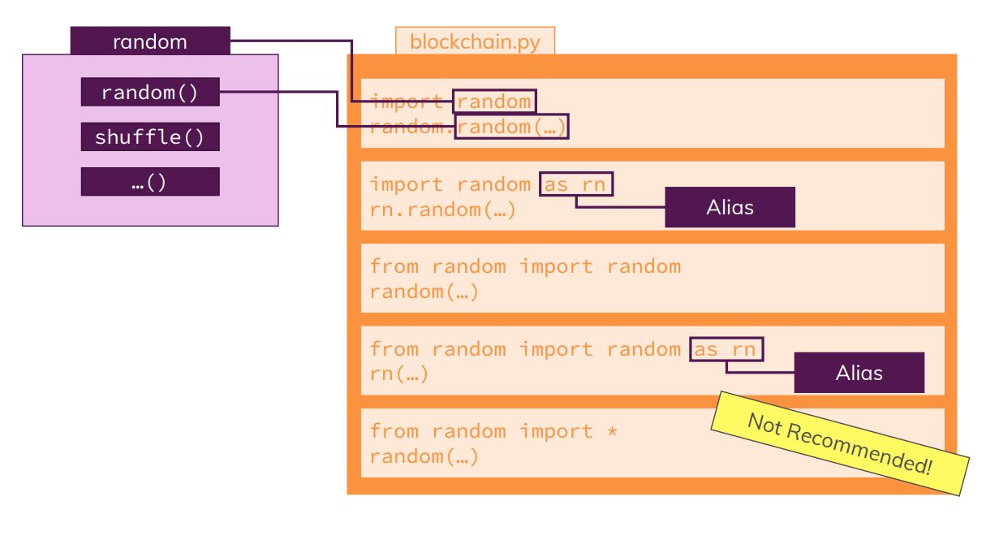
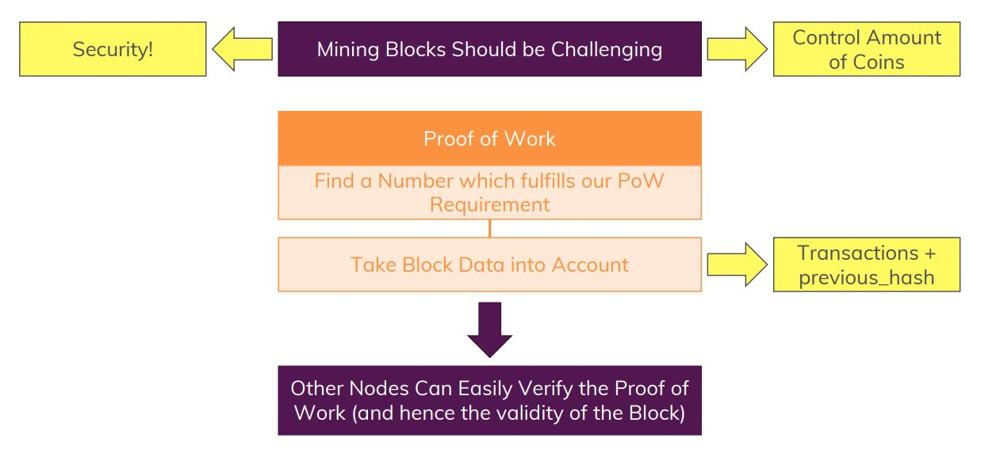
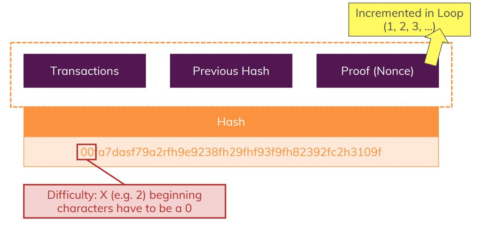
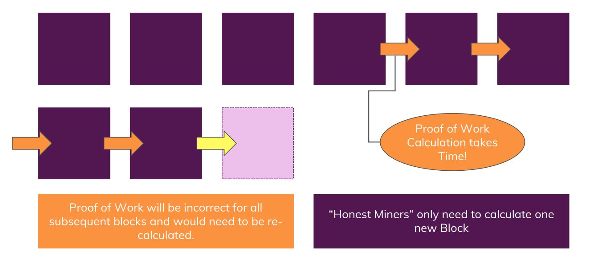
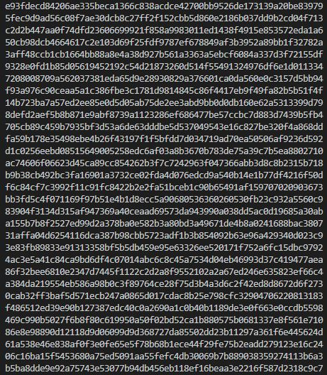
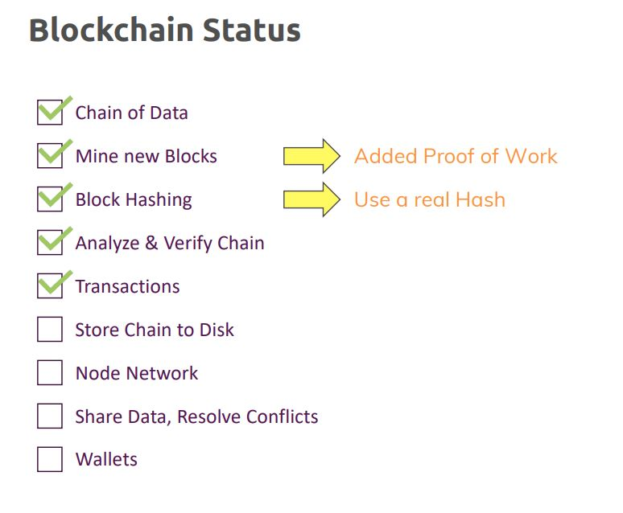

# Python Standard Library

## Module Overview

## What about Blockchain

## Python standard library

Google for python standard library and find out the rich set of library functions available in python

**import** statement is used in the code, to include the feature of the package in your implementation.

## importing packages

## Blockchain Theory: Understanding Hashes

The word "Hash" is omnipresent in the Blockchain world. It's important that you a) understand what exactly a Hash is and b) understand why we use Hashes.

a) What is a Hash?

To keep things simple, a Hash can simply be thought of as a long string (64 characters when using the SHA256 algorithm) that can NOT be reverse engineered. A hash is created based on some input values and the same input values will always yield the exact same Hash. So it's NOT a random value.

But you can't find out what the input was unless you have a Hash table - i.e. a map of inputs and resulting Hashes. That's of course something which is not easily created (brute force would be an option but you have billions of possible combinations - depending on the chosen Hashing algorithm).

b) Why do we use Hashes of Blocks instead of our "string concatenation" technique?

A Hash in our Blockchain has 64 characters. That's probably shorter than a Block with dozens of Transactions - the length of the Hash does not grow or shrink depending on the input value. So it's more efficient to store a Hash than to manually transform all data to string values.

We're not using a Hash because we want to hide the values. We could do this with a Hash but that's not the idea of a Blockchain. All the data should be publicly available, we don't want to hide the Block data - everyone should be able to check and validate the Blockchain.

## importing hashlib to create a unique hash

In the function hash_block(), we are generating the pseudo hash, we write the code for generating real hash

We will **import hashlib** to create hashes, instead of returning custom hash we give a call to SHA256 algorithm in hashlib, The value we pass is a block which is a dictionary which needs to be converted to string, so to convert string we **import json** package.

Refer to the **blockchain1.py file**, run it and check the hash generated

## Using other import syntax

Use aliases instead of the package name: **import hashlib as hl**

Restrict import to specif functions of a package: **from functools import reduce**

## The Proof of Work

## Blockchain Theory: Understanding the "Proof of Work"

In our blockchain, we're already validating that Block #2 has the same hash of Block #1 stored which we would get if we would re-calculate the hash value of Block #2 (which we do as part of our verify-chain method!).

But this is not enough.

Someone could edit Block #1 (e.g. manipulate the transactions stored there) and then also update the block after it (Block #2) to hold the updated hash in the previous_hash  field. And that could then be done for the entire chain.

If we then validate the chain (on other nodes - we'll add nodes later in the course), the chain would be valid. 

That's a problem PoW solves.

Just having equal hashes is then NOT enough anymore. Instead, a so-called PoW number (also referred to as "Nonce") is guessed for each block. PoW is just a number, but it's a number which, together with other input data, yields a hash that suffices a condition defined by us(=> the creators of the blockchain).

That hash is NOT the hash we store in the previous_hash  field! It's not the hash we compare between blocks! We're simply using a hash for this check since it's convenient to check starting characters of a fixed-length (always 64 characters for SHA256) string.

A typical requirement is for the hash to start with X 0s (though you can come up with any condition of your choice). The more 0s we require, the longer it'll take to find a fitting PoW number - that's why for Bitcoin it can take multiple years to generate new block. It of course depends on your hardware setup and whether you're in a mining pool or not. It'll always take longer than just a few seconds though. For Bitcoin, a new block is added roughly every 10 minutes for example.
The hash we use to check the PoW typically takes the transactions that should be included in the new block as well as the previous block's hash and that PoW number into account.

And only if these three inputs yield a hash that starts with two 0s, we accept the hash and therefore the PoW. Since the transactions of the next block as well as the previous block's hash are static, only the PoW is adjusted until a matching hash is found.

The guessed (and fitting) PoW is then also stored in the mined block.

Other nodes can then easily confirm or deny the validity of the block since they just have to create a hash from the three input values (which are all known as they are included in the block). If the PoW doesn't lead to a valid hash, the block is not treated as valid and hence the overall chain is not accepted.

If some node tries to cheat, manipulating a block's transactions + the subsequent blocks previous_hash  values would NOT suffice anymore. For changed transactions and/ or previous_hash values, the old PoW wouldn't yield a valid PoW-hash anymore. A cheater would therefore have to re-calculate all PoW numbers for all subsequent blocks. This will take a huge amount of time since you typically don't check for two 0s but multiple leading 0s. And every additional leading 0 you add, vastly increases required computing time.

"Honest nodes" on the other hand only need to mine one new block in the time the cheater takes to re-calculate potentially dozens of blocks to render the cheater's chain invalid.

That's how PoW secures the blockchain.

### Adding Proof of Work

### Proof of Work

### Cheating the Blockchain

## Adding Proof of work to our blockchain

Refer to **blockchain2.py code**

Define a **valid_proof()** function, it requires transactions, last_hash and proof number as arguments, function body is used to guess the new hash. We check the new hash generated whether ot is precceding with **two zero's**, this is our check to determine whether proof is valid.

Include a another function **Proof_of_work()** uses last_block and last_hash which calls last_block(), initialize proof to 0, have a loop to increment proof, until valid_proof() returns true, then return a proof

## Include proof of work in our mining function

Use prrof_of_work when we mine a block. In the **mine_block()** give a call to proof_of_work() which returns proof, in the block add the proof field and append to our blockchain. also add proof to our genesis block fir instance we initialize to 100.

Also we should ensure the **verify_chain()** to have an additional check to check if our new hash begins with two zero's, add a if block in it.

Mine a new block that gives the output as below: refer to the hashes generated till we find a valid hash

## Fixing a hash order fault

Our current mechanism foe generating a hash one flaw, Our block is defined as dictionary which is unordered. In **hash_block() function use the sort_keys=True**. **import another package collections by importing OrderDict which is to be used in add_tansaction()**. comment out the old transaction and create with OrderedDict().

Refer to **blockchain3.py** file

Test the blockchain with all the options.

## Spltting up our code

Refer to **Final_implementation folder** for the blockchain implemented in this module

## Wrap Up

### Module S1mmary

### What about Blockchain

## Useful Resources & Links

•	The (Standard) Library Reference: https://docs.python.org/3/library/index.html

