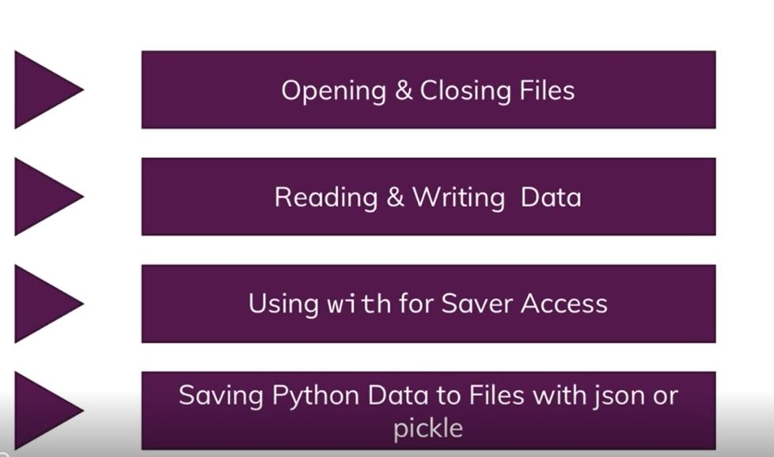
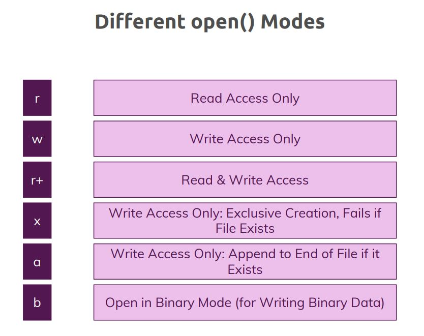
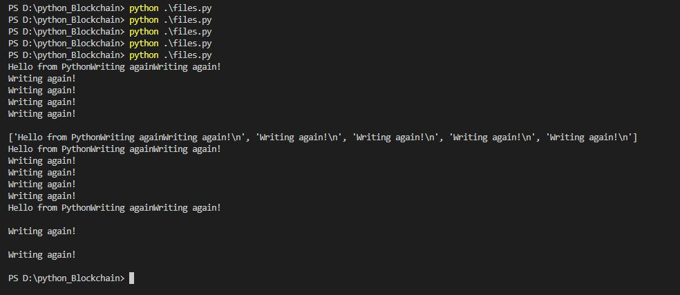

# Working with Files: Because Data Shouldnot always be discarded

## Module Overview

## What about Blockchain

## Handling File access 

Always make sure to close the File object.

## Reading data from file

## Reading multi line content

Refer to **files.py** for the code

## Using the with block statement

Refer to **withstatement.py** for the code

## Adding file access to our blockchain

Refer to **blockchain1.py** file

Code changes are in the new function **save_data()** , this function is called when weare adding new transactions and also when mining a new block. For the write menthod we need to typecast to str, as parameters are list. 

New function **load_data()** , the data read from this has to be initialzed to our blockchain list and open_transactions data. also decalre blockchain and open_transactions as **global variable**. 

## Convertng strings into python objects

Refer to **blockcahin2.py**

We need to import json, while save

