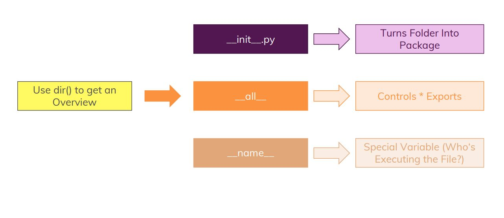
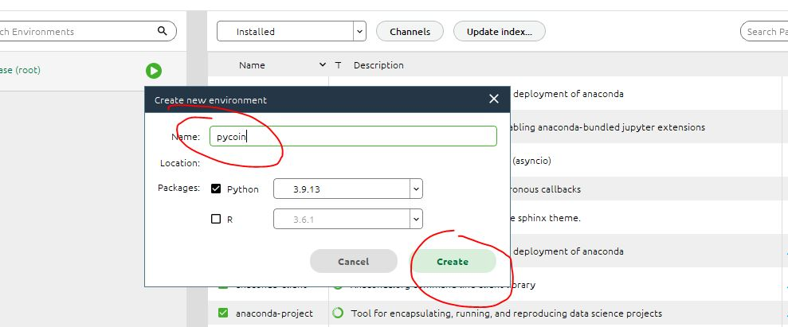
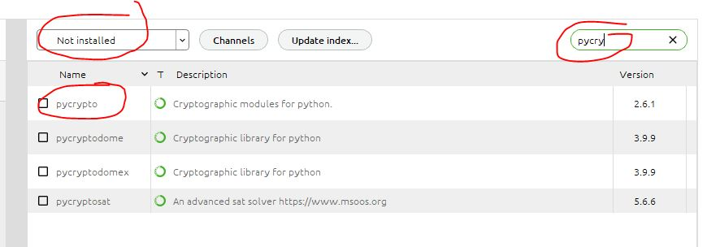
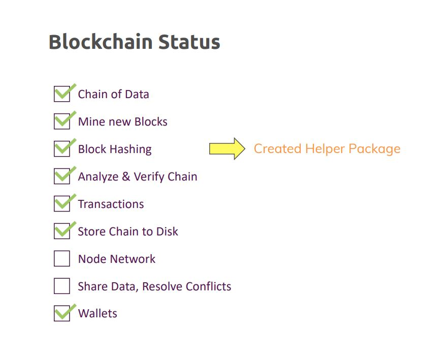

# Working with Modules and Third-party Packages: Splitting up Responsibilities

We create Custom module bundles, Advanced module operations, Installing and using Third-Party Packages

For Blockchain: We add a basic wallet

## Creating packages module bundles

We create a helper package

Understand module docstring

Understand how to control what can be exported

Execution and context name variable: __name__

Transaction signing

Why we need private public key transaction protection:

### Using anaconda to install third party package

Install the python package using terminal

pip install pycrypto

python -m pip install pycrypto

Install the package as shown in figure

Activate the python package environment in VS.

run the coomands

source activate python

or 

activate python

### Generating keys with third party package

Remember to run your project in the new Environment you have created.

Create a **Wallet.py** file

### Connecting node and wallet

### Generating keys on the node

### Saving and loading keys to files

### Creating transaction signatures

### add signature to transactions

### verify signatures

### Improve verification logic

### Summary

Refer to the **Section_Final_code** for the complete code 

### Use Pycryptodome instead of Pycrypto

Instead of the "PyCrypto" package we installed, you can also use the "Pycryptodome" package (http://pycryptodome.readthedocs.io/en/latest/index.html) now. Especially on Windows, "PyCrypto" can fail to run, "Pycryptodome" is a nice drop-in replacement (i.e. no code changes required) that should solve any issues you might have.

### Using Virtual Environments

Virtual Environments allow you to only install certain Python packages for some projects - instead of globally on your machine. This is helpful when working with multiple projects where you might want to use a different set of packages (=> dependencies) for every project.

You can easily create a new virtual environment in the Anaconda Navigator (as shown in the last lecture). Read more here: 

https://docs.anaconda.com/anaconda/navigator/getting-started#navigator-managing-environments

After creating an environment, you need to activate it. There are two ways of doing that:

1.	Execute source activate NAME_OF_ENVIRONMENT  (e.g. source activate pycoin ) on macOS and Linux or just activate NAME_OF_ENVIRONMENT  (e.g. activate pycoin ) on Windows. This might fail for Windows though. To fix it, please see this thread: https://github.com/ContinuumIO/anaconda-issues/issues/2533

2.	Alternatively, you use the Anaconda Navigator to launch a terminal/ command prompt that already uses your new virtual environment: Click on the green "play" button next to your environment name and choose the option to launch a new terminal/ command prompt there. This will be a normal terminal/ command prompt, so after navigating into your project folder (via the cd command), you can use it just as shown in the videos.

### Useful_Links

•	More on Python Modules: https://docs.python.org/3/tutorial/modules.html

•	Using Anaconda: https://docs.anaconda.com/anaconda/

•	PyCrypto Docs: https://pypi.org/project/pycrypto/

